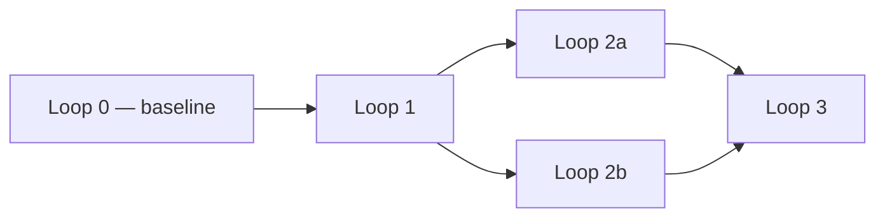

This skill takes the current conversation and codebase understanding and produces `PLAN.md`
at the repo root. Do NOT interview the user; just synthesize what you already know. If real
gaps remain (nothing decided on some point), list them under "Open questions" instead of
guessing.

Respect this project's `CLAUDE.md` — its engineering principles govern how the plan is shaped,
not just how the code inside it is written. In particular: baseline end-to-end before
optimizing, one verified step at a time, fail loud, no premature abstraction.

**Self-contained is the whole point.** `PLAN.md` must let a brand-new conversation — one that
has never seen this one, the same way `/implement-plan` might run in a fresh chat days later —
implement it to the **same quality** this conversation would have reached, not merely produce
something that technically satisfies the steps. The only context that fresh conversation is
guaranteed to have is the repo on disk (including `CLAUDE.md`) and general domain knowledge.
That bar means writing down more than facts and decisions: capture the *why* behind each one,
so that when the implementer hits a judgment call the plan didn't explicitly anticipate, they
have enough reasoning to decide it the way this conversation would have — not just enough
instructions to avoid getting stuck. Never write "as discussed," "per our conversation," "the
approach we agreed on" — write what was decided and why, as if for a stranger who has to make
the same kind of calls you're not around to answer.

## Process

1. Explore the repo if you haven't already, so the plan references real files/modules, not
   guesses.
2. Break the work into **loops**: small, sequential, end-to-end increments. Each loop should
   leave the system in a working, demonstrable state — loop 0 is the ugliest possible
   end-to-end baseline, later loops refine it. Never a loop that only touches one isolated
   layer (e.g. "write all the prompts") with nothing runnable at the end.
3. For each loop, work out which of its steps are strictly sequential (B needs A's output) and
   which are independent and can be done in parallel (by subagents, or just in any order). Don't
   mark things parallel just to look efficient — only when there's no real dependency.
4. Define each loop's tests **before** its implementation steps, and order the steps so the
   tests get written first. Tests written after the code tend to get shaped around whatever the
   code already does — biased confirmation, not real coverage. Instead: pin down what "correct"
   means for the loop (from the requirements, not from an implementation that doesn't exist
   yet), write that down as the test, and only then list the steps that make it pass. For each
   test: what it verifies, how (unit test, manual run + eyeballed output, comparison against a
   hand-computed value), and the exact command to run it. A loop without a way to verify it is
   not done, is not a loop — fix that before writing it down.
5. Draw the loop dependency map as a Mermaid diagram (`flowchart LR`), not just prose or ASCII
   arrows — parallel branches and merge points read faster as a graph than as text. If a single
   loop's internal steps are non-trivial to follow (several parallel branches merging back into
   a sequential step), give that loop its own small Mermaid diagram too.
6. Sketch the target file tree: every file the plan will create or modify, in its final layout,
   as one tree covering the whole plan (not one per loop). Mark new files/directories so it's
   obvious what doesn't exist yet.
7. Go detailed, not vague. A step is not "done" as a plan item until someone could pick it up
   without asking a follow-up question:
   - Name the actual file/module/function being created or touched (`recipe_matcher.py:
     match_pantry()`), not "handle matching logic."
   - State the concrete input and output shapes (fields, types, units), not "process the data."
   - Call out edge cases and how they're handled (missing unit cost, ingredient absent from
     one sheet, mismatched units) — per CLAUDE.md, these must fail loud, never silently.
   - For anything involving money or quantities, name the exact formula or reference the one
     in `CLAUDE.md` rather than re-describing it loosely.
   - Prefer several precise, narrow steps over one broad one ("parse Despensa sheet into
     PantryItem list" + "parse Precos sheet into unit costs" rather than "load spreadsheet").
8. Capture every architecture-level decision the conversation actually made — model choice,
   tools/MCP, memory design, library picks, anything that isn't obvious from `CLAUDE.md` or the
   repo as it stands — under "Key decisions," including the rejected alternative and why. If
   it was decided in the conversation and isn't written here, it doesn't exist for whoever
   implements this next.
9. Do a fresh-eyes pass before finalizing: reread the whole draft pretending you are a new
   conversation that never saw this one, with only the repo and the plan in front of you. Flag
   and fix anything that leans on unstated context — an unexplained term, a decision referenced
   but not stated, a step that only makes sense if you remember the discussion. If a gap can't
   be closed from the repo or general knowledge, move it to "Open questions" instead of leaving
   it implicit. Then check the harder thing: not just "could this fresh conversation avoid
   getting stuck," but "would it make the same quality-level calls this conversation would" —
   for every decision recorded, is the *why* there too, or only the *what*? A plan that only
   lists conclusions forces a fresh implementer to re-derive the reasoning (and maybe get it
   wrong) the first time reality doesn't match a step exactly.
10. Write `PLAN.md` using the template below, then show the user a short summary (loop count,
    what's sequential vs parallel) and ask them to confirm before treating the plan as final.

<plan-template>

# Implementation Plan — <title>

## Context
A standalone briefing, not a summary of "what we talked about": enough for someone who was
never in the conversation to know what's being built, why, and against what constraints.
Reference source-of-truth files by path (e.g. the challenge brief, the data file) instead of
restating everything, but state directly anything that exists only because this conversation
decided it.

## Requirements
Objective list of what must be true at the end. Each item must be verifiable (yes/no), not an
aspiration.

## Key decisions
Architecture-level decisions this conversation made that aren't already obvious from `CLAUDE.md`
or the repo — model choice, tools/MCP, memory design, notable library picks, anything a fresh
implementer would otherwise have to guess or re-decide. For each: the decision, and the
alternative that was rejected and why.

## Definition of Done (global)
- [ ] Every loop below is complete, each with its own DoD satisfied
- [ ] **The entire project test suite passes** (not just the new tests — the old ones too)
- [ ] <other project-specific global criteria, e.g. numbers match a hand-computed check>

## Target file tree
The full layout once every loop is done, in one tree (not split per loop). Mark what's new.

```
repo-root/
├── existing_module.py
├── new_module.py              # new — added in Loop 1
├── pantry/
│   ├── __init__.py            # new — added in Loop 0
│   └── parser.py              # new — added in Loop 0
└── tests/
    └── test_pantry_parser.py  # new — added in Loop 0
```

## Dependency map
A Mermaid flowchart showing the real order: what is strictly sequential and what can run in
parallel. Example:



## Loops

### Loop 0 — <short name> (end-to-end baseline)
**Depends on:** nothing
**Goal:** the ugliest possible version of the full flow, running end to end.

**Requirements for this loop**
- ...

**Tests** *(write these first — before the steps below)*
- <what it verifies> — command: `...`
- <manual verification, if applicable, e.g. check the CMV by hand for 1 dish>

**Steps**
1. *(sequential)* Write the test(s) above (they must fail first — nothing to make them pass
   yet).
2. *(sequential)* <file/module: function> — <concrete input> → <concrete output>;
   edge cases: <how each fails loud>
3. *(sequential)* ...

**Definition of Done for this loop**
- [ ] Tests above were written before the implementation steps
- [ ] Steps completed
- [ ] Tests above pass
- [ ] Flow runs end to end at least once, output inspected

### Loop 1 — <short name>
**Depends on:** Loop 0
**Can run in parallel with:** <another loop, if any — omit this line otherwise>

**Requirements for this loop**
- ...

**Tests** *(write these first — before the steps below)*
- ...

**Steps**
1. *(sequential)* Write the test(s) above (they must fail first).
2. *(parallel with each other)*
   - a) ...
   - b) ...
3. *(sequential, depends on 2)* ...

*(If this loop's step graph isn't obvious from the list above, add a small
`flowchart TD` here instead of, or in addition to, the numbered list.)*

**Definition of Done for this loop**
- [ ] Tests above were written before the implementation steps
- [ ] Steps completed
- [ ] Tests above pass

<!-- repeat one "### Loop N" block per loop -->

## Out of scope
What was explicitly decided NOT to do now, and why (prevents someone "remembering" it later
and doing it anyway).

## Open questions
Points the conversation did not resolve. If this list isn't empty, the plan is not ready for
execution without revisiting those questions (e.g. via `/grilling`).

</plan-template>
