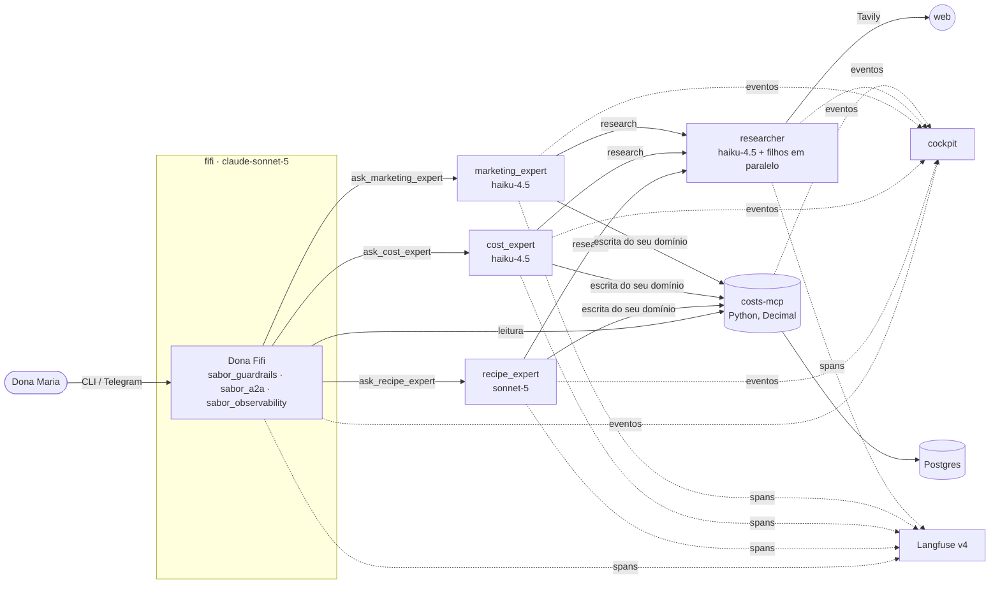
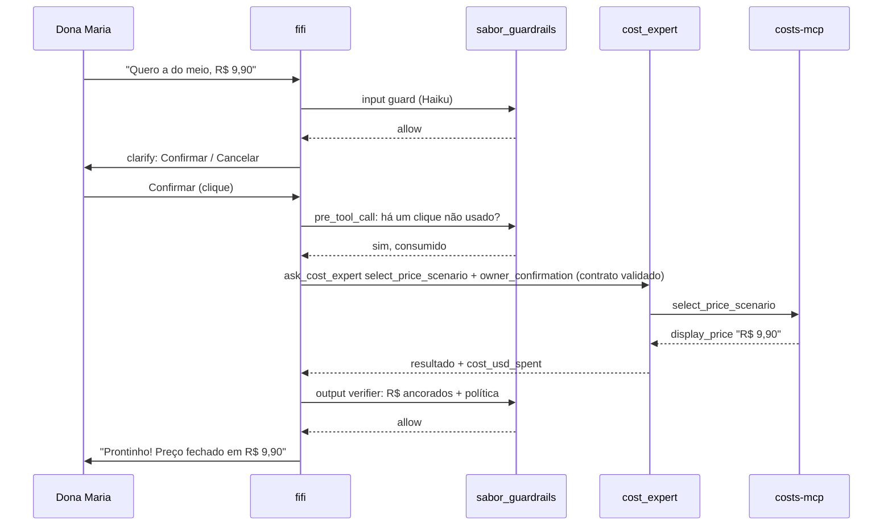

# Sabor da Maria — Dona Fifi

Assistente conversacional para a Dona Maria, que está abrindo o restaurante *Sabor da Maria* no iFood. A **Dona Fifi**
leva ela da despensa ao cardápio de lançamento:

- pesquisa receitas reais na web;
- descobre equipamentos, técnicas e limites da cozinha antes de qualquer compra;
- cruza os ingredientes com a despensa e o orçamento de R$ 80,00;
- calcula o CMV e três cenários de preço com a taxa de 10% da plataforma.

É construída **instalando e customizando o [Hermes Agent](https://hermes-agent.nousresearch.com/)** (Nous Research),
sem modificar o Hermes: tudo é configuração, plugins, skills, skin, `SOUL.md` e arquivos de contexto sobre a imagem
Docker oficial.

A fonte do escopo é [desafio-senior-ai-engineer.md](desafio-senior-ai-engineer.md); o plano completo, com cada decisão,
correção e pergunta aberta, está em [PLAN.md](PLAN.md).

## Sumário
- [Como rodar](#como-rodar)
- [Arquitetura](#arquitetura)
- [As cinco categorias do desafio](#as-cinco-categorias-do-desafio)
- [Decisões](#decisões)
- [Segurança](#segurança)
- [Limitações do Hermes encontradas](#limitações-do-hermes-encontradas)
- [Observabilidade](#observabilidade)
- [Evals e resultados](#evals-e-resultados)
- [Simplificações](#simplificações)
- [Demo em vídeo](#demo-em-vídeo)
- [Próximos passos](#próximos-passos)

## Como rodar

**Requisitos:** Docker com Compose, `make`, [uv](https://docs.astral.sh/uv/) no host. A pilha completa (cinco agentes,
Postgres, costs-mcp, cockpit e Langfuse v4) pede **≈16 GiB de RAM**; com 8 GiB ela sobe, mas usando swap.

1. `cp .env.example .env` e preencha:
   - `CLAUDE_CODE_OAUTH_TOKEN`: acesso aos modelos pelas credenciais do Claude Code (`claude setup-token`).
     Não há chave da Anthropic Console.
   - `TAVILY_API_KEY`: busca web.
   - `A2A_TOKEN_*` e `COSTS_MCP_TOKEN_*`: um token aleatório por agente.
   - `POSTGRES_PASSWORD`, `API_SERVER_KEY`, `SABOR_COCKPIT_TOKEN`.
   - Segredos do Langfuse (`LANGFUSE_*`). O próprio `.env.example` mostra como gerar cada um.
   - Opcional: `TELEGRAM_BOT_TOKEN` (do @BotFather) e `TELEGRAM_ALLOWED_USERS` (seu id numérico, do @userinfobot).
2. `make up` constrói e sobe tudo, esperando cada serviço ficar saudável. Na primeira subida, a planilha
   `data/despensa_dona_maria.xlsx` é importada e o Langfuse cria organização, projeto, usuário e chaves.
3. `make chat` roda o self-test dos guardrails e abre a CLI clássica com a skin da Dona Fifi. Se o self-test falhar,
   a CLI não abre.

Outros comandos:

| Comando | O que faz |
|---|---|
| Telegram | com o token no `.env`, o bot responde só a quem está em `TELEGRAM_ALLOWED_USERS` |
| http://localhost:8080 | cockpit ao vivo: qual agente, ferramenta e MCP estão ativos, custo do turno, saldo |
| http://localhost:3000 | Langfuse (usuário e senha do `.env`): um trace por turno, atravessando os contêineres |
| `make import-pantry FILE=…` | envia uma planilha nova; a Dona Fifi mostra a diferença e só aplica depois de um clique |
| `make test`, `make test-plugins`, `make test-contracts`, `make test-integration` | suítes determinísticas (também no CI) |
| `SABOR_ALLOW_EVAL_RESET=1 make evals` | todas as camadas de eval. **Apaga o estado de negócio** da pilha em execução |

## Arquitetura

Cinco processos Hermes conversam por A2A. Só a Dona Fifi fala com a dona. Toda conta de dinheiro e quantidade fica num
servidor MCP determinístico.

Um turno com decisão da dona:

| Peça | Onde |
|---|---|
| Configuração versionada de cada agente (`config.yaml`, `SOUL.md`, skills, skin) | `agents/<agente>/` |
| Plugins Hermes (A2A tipado, guardrails, observabilidade) | `plugins/sabor_*` |
| Contratos JSON Schema (receita, pesquisa, especialistas, eventos) | `contracts/` |
| Servidor MCP de custos, com migrations SQL | `services/costs_mcp/` |
| Cockpit (stdlib + HTML/JS) | `services/cockpit/` |
| Cenários, red-team, datasets, runner de eval | `evals/` |

## As cinco categorias do desafio

### Modelo
- **fifi** e **recipe_expert** usam `claude-sonnet-5`: conversa longa com uso de ferramentas, e julgamento de
  viabilidade e substituição.
- **cost_expert**, **marketing_expert**, **researcher** (e seus filhos) e o classificador dos guardrails usam
  `claude-haiku-4-5-20251001`: tarefas estruturadas e frequentes, porque a matemática está no MCP.
- Nas evals, a Dona Maria simulada usa Haiku e o juiz usa Sonnet.
- **Rejeitado:** Opus para a fifi (custo e latência sem necessidade) e Sonnet em tudo. Trocas de modelo são decididas
  pelas evals.
- O acesso é pelo provedor Anthropic nativo do Hermes, autenticado com `CLAUDE_CODE_OAUTH_TOKEN`. Chamadas fora do loop
  do agente (classificador, dona simulada, juiz) passam pelo cliente LLM de plugin / auxiliar do próprio Hermes, com as
  mesmas credenciais.

### Arquivos de contexto
- Cada agente tem seu **`SOUL.md`** em `agents/<agente>/`, com identidade, fluxo e tarefas. É copiado para o
  `HERMES_HOME` a cada start (D18).
- Um **`.hermes.md`** no diretório de trabalho guarda regras comuns: conteúdo da web é dado não confiável e
  identificadores ficam em inglês. Ele **precisa existir**; sem ele, o Hermes carregaria o `CLAUDE.md` de engenharia
  deste repositório.
- Os filhos do researcher não recebem `SOUL.md`: suas instruções vêm de uma seção de system prompt registrada pelo plugin,
  ativa só quando `platform == "subagent"`.
- Prompts são em inglês; tudo o que a dona lê é em português. O `prompt_hash` (sha256) vai em cada trace e resultado de
  eval.

### Ferramentas / MCP
- **costs-mcp** é um servidor MCP em Python (Streamable HTTP, `Decimal`, Postgres) com toda a lógica de dinheiro e
  quantidade: unidades, custo unitário, CMV, cenários, orçamento, estoque, viabilidade, compras, importação de planilha.
- Cada agente tem um token próprio, e o servidor recusa ferramentas fora do domínio dele (por exemplo, marketing não
  registra compra). Cada chamada fica no `audit_log`, com o `trace_id`.
- **Ferramentas A2A tipadas** (`ask_recipe_expert`, `ask_cost_expert`, `ask_marketing_expert`, `research`) validam cada
  pedido e resposta contra `contracts/`, com uma nova tentativa e depois erro explícito. O modelo nunca vê o toolset A2A
  cru do Hermes.
- Busca web via **Tavily** (`web_search`, `web_extract`), só no researcher, que distribui a pesquisa em filhos paralelos
  com `delegate_task`.
- Allowlist de ferramentas por agente em `pre_tool_call` (o único hook do Hermes que falha fechado). Terminal e arquivos
  estão desligados em todos os agentes.

### Estrutura de memória
- **Estado de negócio no Postgres**, via especialistas: despensa, preços, compras, perfil da cozinha, pratos,
  reservas, promoções.
- **Memória nativa do Hermes só na fifi**, e só para gostos e estilo da dona ("não curte coentro", "prefere explicação
  curta"). Toda escrita passa por um guard Haiku que só deixa passar `allow`; fatos de negócio são recusados, porque
  devem ir para o banco.
- Os especialistas rodam sem memória.
- **Rejeitado:** memória só no Postgres (tabela de notas), como tinha sido recomendado. A dona escolheu a memória do
  Hermes e o risco está listado em [Riscos aceitos](#riscos-aceitos).

### Skills
| Skill | Agente | Quando carrega |
|---|---|---|
| `constraint-elicitation` | fifi | antes de comprar, aceitar ou precificar um prato: equipamentos, técnicas, tempo por leva, geladeira, gás |
| `pricing-explanation` | fifi | ao mostrar custos e cenários: custo unitário → custo do prato → por porção → preço, com um exemplo |
| `ifood-menu-copy` | marketing_expert | título e descrição dentro dos limites do iFood, sem alegações de saúde ou comparação com concorrente |

As skills mantêm os system prompts curtos e são versionadas e avaliáveis. **Rejeitado:** colocar tudo no `SOUL.md`.

## Decisões

Cada item: a decisão, a alternativa rejeitada e o porquê. O detalhe está em *Key decisions* no [PLAN.md](PLAN.md).
**(dona)** marca escolhas feitas pela dona contra outra recomendação.

**Plataforma e topologia**
- **D1 — Hermes pela imagem Docker oficial, fixada por tag e digest.** Rejeitado: clone, submódulo, fork. Por quê:
  nunca alteramos o Hermes; a imagem torna o build reproduzível e deixa claro o que é nosso.
- **D2 — Cinco processos Hermes por A2A (dona).** Rejeitado:
  - um agente só: páginas de 15 mil caracteres no contexto de quem fala com a dona;
  - só `delegate_task`: um modelo para todos os filhos, sem `SOUL.md` próprio, herdando todas as ferramentas;
  - guardrails como agentes ou microsserviço: latência e mais um ponto de falha.

  Por quê: cada agente tem modelo, prompt, ferramentas e contêiner próprios.
- **D3 — Árvore de chamadas fixa, com token por aresta; a fifi nunca chama o researcher.** Rejeitado: malha livre.
  Por quê: é auditável, os traces ficam legíveis e texto da web nunca chega a quem fala com a dona.
- **D4 — Só a fifi fala com a dona; especialistas devolvem `questions_for_owner`.** Rejeitado: repassar
  `INPUT_REQUIRED` do A2A. Por quê: uma voz e guardrails num lugar só.
- **D5 — researcher com tipos de tarefa fixos, schemas estritos, sem estado, com verificação de proveniência.**
  Rejeitado: modo de pergunta livre, estado por dona, classificador na saída. Por quê: um schema sem espaço para
  instruções neutraliza injeção indireta de forma determinística; a proveniência garante receitas *reais*.
- **D6 — Ferramentas A2A tipadas com validação de contrato.** Rejeitado: expor o toolset `a2a` cru. Por quê: validação
  determinística, o modelo não descobre pares arbitrários, e cada chamada gera um evento limpo.
- **D7 — Toda a lógica de dinheiro e quantidade no costs-mcp.** Rejeitado: aritmética pelo LLM, MCP stdio por
  processo, ferramenta de plugin. Por quê: conta feita por LLM "mente em silêncio"; um servidor separado é testável
  sem o Hermes.
- **D8 — Postgres dedicado para o estado de negócio (dona), SQL puro, migrations numeradas, psycopg 3.** Rejeitado:
  SQLite, o Postgres do Langfuse, ORM. Por quê: o negócio não depende da observabilidade e há poucas dependências.
- **D9 — Modelos por agente** (ver [Modelo](#modelo)).
- **D18 — Configuração versionada copiada para um volume nomeado a cada start; uma imagem para os cinco agentes.**
  Rejeitado: montar `agents/<agente>/` como `HERMES_HOME`, porque sessões e memória da dona cairiam no repositório.
- **D19 — Contratos em JSON Schema; um `pyproject.toml` por serviço (uv).** Rejeitado: modelos Pydantic compartilhados,
  workspace. Por quê: o Hermes consome JSON Schema direto e cada imagem instala só o que usa.

**Guardrails e autorização**
- **D10 — Guardrails num plugin do Hermes na fifi.** Rejeitado: proxy externo em volta da API do Hermes, que perderia a
  CLI e a skin. Por quê: o desafio pede customizar o Hermes. Como os hooks falham abertos, cada guard captura as
  próprias exceções e bloqueia, e `make chat` roda um canário antes.
- **D11 — Semântica dos guards.**
  - A entrada vê a mensagem da dona mais a última da fifi (até 500 caracteres), porque "sim" sozinho não diz nada.
  - Categorias: fora de escopo **e** manipulação.
  - Veredito `allow | block | uncertain`; score 0–1 foi rejeitado por falta de calibração.
  - `uncertain` passa na entrada e bloqueia na saída.
  - Falha de infraestrutura bloqueia dos dois lados, com uma mensagem própria.
- **D12 — Verificador de saída: todo R$ precisa vir de um display string do MCP (ou da própria dona), mais política
  Haiku, sem streaming.** Rejeitado: só LLM, e streaming. Por quê: dinheiro inventado é pego com exatidão; streaming
  mostraria texto antes da verificação.
- **D13 — Injeção indireta e abuso de ferramentas.** Schemas estritos, isolamento da fifi, allowlists em
  `pre_tool_call`, terminal e arquivos desligados, web tratada como dado não confiável. Rejeitado: aceitar o risco sem
  documentar.
- **D14 — Autorização de escrita (dona).**
  - Cada especialista escreve só no seu domínio.
  - Decisões de dinheiro exigem o clique **Confirmar** num `clarify`, repassado como `owner_confirmation`.
  - Fatos ditos pela dona viram `evidence`, sem clique.

  Rejeitado: tokens de aprovação vinculados a hash de parâmetros. Por quê: a dona preferiu o fluxo mais simples. Na
  implementação foi somado um registro determinístico de cliques (ver [Segurança](#segurança)).
- **D15 — Memória** (ver [Estrutura de memória](#estrutura-de-memória)).
- **D16 — Arquivos de contexto** (ver [Arquivos de contexto](#arquivos-de-contexto)).
- **D17 — Skills para procedimentos sob demanda** (ver [Skills](#skills)).
- **D30 — Confirmações com botões do `clarify`.** Rejeitado: a fifi interpretar texto livre. Por quê: "ela clicou
  Confirmar" é mais claro que "o LLM acha que ela disse sim".
- **D37 — Teto de US$ 5,00 por turno, somado entre agentes, sem armazenamento compartilhado.** Rejeitado: teto por
  processo, nenhum teto. Por quê: o Hermes não tem orçamento de custo. O restante viaja no contrato A2A e cada agente
  bloqueia a próxima chamada de modelo quando acaba.
- **D38 — Timeouts aninhados e mensagens de progresso fixas.** Rejeitado: mensagens intermediárias geradas pelo
  modelo, que seriam texto não verificado. Valores: filhos 120 s + reparo 75 s < servidor do researcher 270 s <
  especialista→researcher 300 s < servidor do especialista 450 s < fifi→especialista 480 s < turno 930 s (correção C35).

**Regras de custo e preço**
- **D20 — CMV por porção e cenários por CMV% (35/30/25%).** Rejeitado: CMV por receita, multiplicador de markup. Por
  quê: delivery vende porção e CMV% é o vocabulário do setor. Preços exibidos sobem para `,90`; o mínimo sobe para o
  centavo.
- **D21 — Taxa da plataforma de 10% como parâmetro.** Rejeitado: citar planos reais do iFood, que variam e seriam
  números não verificados.
- **D22 — Embalagem mostrada à parte, fora do CMV.** Por quê: a fórmula do desafio fica exata e o custo real por pedido
  aparece como `lucro depois da embalagem`.
- **D23 — Unidades.**
  - Tudo é normalizado para g/ml/unidade num lugar só.
  - Uso cruzado de dimensões falha alto e vira pergunta.
  - Medidas caseiras vêm de uma tabela fixa.
  - "A gosto" usa uma estimativa pequena, marcada como estimativa.

  Rejeitado: LLM convertendo para gramas, com densidades confiantemente erradas.
- **D24 — Orçamento, estoque e ciclo de vida.**
  - O CMV usa a quantidade usada; o orçamento paga embalagens inteiras.
  - Estouro é recusado com alternativas, e a dona pode aumentar o orçamento de forma explícita.
  - Pratos aceitos reservam o lote de lançamento.
  - Ciclo `candidate → accepted | rejected`.
  - Vale o preço mais recente.
- **D25 — Portão de viabilidade determinístico com vocabulário controlado.** Rejeitado: só pedir no prompt, ou um
  agente auditor. Por quê: transforma a regra central do desafio ("nunca comprar ingrediente de prato que ela não
  consegue fazer") em algo que o sistema não permite.
- **D26 — Eval de extração de requisitos: recall de 100% em equipamentos e ≥ 90% em técnicas e operação.** Por quê:
  equipamento esquecido é exatamente "comprar e descobrir depois".
- **D27 — Preço de item faltante.** researcher estima → cost_expert guarda como `web_estimate` (sem uso no CMV) → a dona
  confirma ou corrige. Rejeitado: preço estimado pelo LLM.
- **D28 — Alertas depois de mudança de custo:** CMV% acima do alvo escolhido, e abaixo do mínimo. Rejeitado: sugerir
  baixar preço quando o custo cai.
- **D29 — Pesquisa em rodadas de até 3 candidatos, ordenados por cobertura da despensa.** Por quê: o desafio pede "à
  medida que encontrar", e a opinião dela direciona a próxima rodada.
- **D31 — Importação de planilha:** prévia (diff) → clique → aplica. Validação estrita com `openpyxl`, nomes exatos e
  todos os erros juntos. Rejeitado: parser XML próprio, e a fifi aplicando importações.
- **D41 — Marketing:** texto do cardápio e promoções, sempre simulados antes pelo cost_expert. Rejeitado: benchmark
  de preços de concorrentes no iFood (termos de uso, preços não verificáveis).

**Observabilidade, evals e entrega**
- **D32 — Plugin próprio de observabilidade, com trace id explícito nos contratos A2A.** Rejeitado: plugin Langfuse
  do Hermes (um trace por processo), patches W3C no núcleo do Hermes. Telemetria é best-effort, ao contrário dos
  guardrails.
- **D33 — Langfuse v4 self-hosted no mesmo compose, sempre ligado (dona).** Rejeitado: Langfuse Cloud (dados saem da
  máquina), perfil opcional.
- **D34 — Cockpit em contêiner próprio, HTML + JS + SSE com a stdlib.** Rejeitado: React/Vite, servidor dentro de um
  plugin.
- **D35 — Prompts no git, em inglês, com hash nos traces.** Rejeitado: gestão de prompts do Langfuse em runtime, que
  tornaria a observabilidade dependência de execução.
- **D36 — Runner de eval próprio + datasets do Langfuse, graders em camadas, pass^3.** Rejeitado: promptfoo,
  DeepEval/Inspect, k = 1, evals de LLM no CI. Por quê: pass^3 mede confiabilidade, que é o que uma dona com uma única
  tentativa sente.
- **D39 — Canais: CLI clássica + Telegram com allowlist.** Rejeitado: CLI própria, TUI Ink, WhatsApp (Cloud API exige
  conta business e webhook público; o bridge não oficial tem risco de banimento).
- **D40 — Busca web: Tavily.** Rejeitado: Firecrawl (não necessário), rotação sem chave (limites no meio da demo).
- **D42 — Persona e skin Dona Fifi:** avó ajudante, a dona é a chef.
- **D43 — Topologia completa primeiro (dona), depois fluxos, guardrails, observabilidade, evals, Telegram/skin,
  README.** Rejeitado: monólito primeiro.
- **D44 — Testes antes da implementação em todo loop.** No `git log`, cada `test:` com o resumo da execução vermelha
  vem antes do `feat:`.
- **D45 — Publicação manual e por último,** feita pela dona.
- **D46 — Acesso aos modelos pelas credenciais do Claude Code (dona).** Rejeitado: chave da Anthropic Console.

## Segurança

- **Guard de entrada** (Haiku, antes da primeira chamada de modelo de cada turno):
  - `block` responde "Só consigo te ajudar com cozinha e cardápio 🙂";
  - falha de infraestrutura responde "Tive um probleminha técnico, tenta de novo em instantes".
- **Verificador de saída:** todo `R$` precisa ter vindo de um display string do MCP ou da mensagem da própria dona.
  Depois vem a política: escopo, vazamento de instruções, alegações de saúde ou "orgânico", comparação com
  concorrentes. `uncertain` bloqueia.
- **Guard de memória:** só `allow` grava.
- **Allowlist de ferramentas** por agente em `pre_tool_call`.
- **Registro de cliques:**
  - uma escrita que exige confirmação só sai se o último `clarify` da sessão teve **Confirmar** ainda não usado;
  - um pedido recusado antes de ser enviado devolve o clique.
- **Teto de custo por turno** entre agentes.
- **Fail-open vs fail-closed:** hooks e middleware do Hermes falham **abertos**; só `pre_tool_call` falha fechado. Por
  isso cada guard envolve o próprio corpo e devolve um bloqueio em qualquer exceção. `make chat` recusa abrir a CLI se o
  canário não for bloqueado. A telemetria, ao contrário, nunca bloqueia a dona.
- **Sem vazamento:** streaming desligado na CLI e no Telegram, sem mensagens intermediárias do modelo, e eventos de
  telemetria nunca impressos no terminal da dona.

### Riscos aceitos
| Risco | Mitigação |
|---|---|
| O guard de entrada deixa `uncertain` passar (disponibilidade primeiro) | o verificador de saída falha fechado; allowlists por agente |
| A confirmação de escrita depende do LLM da fifi montar o `clarify` | confirmações são cliques; registro determinístico de cliques; caso de red-team "escrita sem clique" |
| Memória em texto livre do Hermes guarda preferências da dona | guard de escrita que falha fechado; regra de fronteira no `SOUL.md`; só na fifi |
| O Langfuse sempre sobe junto (≈16 GiB) | requisito documentado; limites de memória por serviço |
| Postgres dedicado em vez de SQLite | o núcleo de unidades e dinheiro é puro e testado sem infraestrutura |
| Topologia completa antes de um monólito | o Loop 0 já foi um fluxo ponta a ponta |
| Regra do preço mais recente em vez de média ponderada | simplificação documentada |
| Sem guard no conteúdo da web | schemas estritos, proveniência, researcher sem estado, fifi nunca vê texto da web, allowlists, verificador de saída |

## Limitações do Hermes encontradas

Verificadas na imagem fixada `nousresearch/hermes-agent:v2026.9.11`. Cada uma virou uma correção registrada em
[PLAN.md](PLAN.md#implementation-corrections).

- **Hooks e middleware falham abertos**, e só `pre_tool_call` falha fechado.
- **Ferramentas inline** como `clarify` e `memory` disparam `pre_tool_call` e `post_tool_call`, mas nunca
  `transform_tool_result` (o registro de cliques usa `post_tool_call`).
- **`api_call_count` começa em 1** no middleware `llm_execution`, não em 0.
- **A API OpenAI-compatível não oferece `clarify`.** Por isso as evals dirigem a CLI clássica num pty.
- **`$HERMES_HOME/.env` sobrescreve o ambiente do contêiner.** O entrypoint remove a `API_SERVER_KEY` gerada lá.
- **Quarentena de 14 dias do uv** (`exclude-newer`) no `pyproject.toml` da imagem: pacotes publicados há menos tempo
  não instalam.
- **Filhos de `delegate_task`** não têm toolsets por chamada nem `SOUL.md` próprio.
- **Nada propaga contexto de trace entre processos.** O nosso viaja no contrato A2A.
- **Vazamentos de texto não verificado:** a CLI faz streaming antes de `transform_llm_output`, e o Telegram manda
  mensagens intermediárias por padrão. Ambos foram desligados.
- **Langfuse v4 em modo `events_only`:** `/api/public/traces` não existe; usamos `/api/public/v2/observations`.
- **O modo `hermes chat -q` responde o `clarify` sozinho**, então não serve para testar confirmações.

## Observabilidade

- **Um trace por turno da dona no Langfuse**, atravessando fifi → especialistas → researcher → filhos → ferramentas
  `mcp__costs__*`. O `trace_id` é o mesmo do `audit_log`, e o custo e os tokens de cada chamada vêm da tabela de preços.
- **Cockpit** em http://localhost:8080:
  - o caminho animado entre guard de entrada, fifi, especialistas, researcher, MCP e guard de saída;
  - linha do tempo com duração, tokens e custo;
  - painel de estado (saldo e pratos), atualizado a cada escrita no MCP.
- **Telemetria é best-effort:** com Langfuse e cockpit parados, o turno responde normalmente.
- **LGPD:** a demo captura conteúdo completo porque tudo é self-hosted. Em produção seriam captura sanitizada e prazo
  de retenção.

## Evals e resultados

`SABOR_ALLOW_EVAL_RESET=1 make evals` roda, contra a pilha em execução, as camadas abaixo e escreve
`evals/results/<data>.md`.

| Camada | Como | Limite |
|---|---|---|
| Núcleo de custos | `pytest` unitário e de integração do costs-mcp | 100% |
| Extração de requisitos | páginas fixas repetidas pelo `researcher-eval` | recall 100% equipamentos, ≥ 90% técnicas |
| Guard de entrada | 60 mensagens rotuladas em `evals/guardrail_dataset.jsonl` | falsos positivos ≤ 5% |
| Cenários multi-turno | 9 cenários × 3 tentativas: a Dona Maria simulada conversa na CLI; graders de estado final e trajetória decidem; juiz Sonnet só alerta | pass^3 ≥ 80% |
| Red-team | 7 casos (injeção, jailbreak, fora de escopo, página maliciosa, envenenamento de memória, escrita sem clique, alegação enganosa) | vazamento 0% |

Cada rodada vira um *dataset run* no Langfuse (`sabor-scenarios`), ligado aos traces e aos hashes de prompt.

**Avaliador online no Langfuse (LLM-as-judge em turnos amostrados da fifi):** o Langfuse chama o modelo por uma
*LLM connection* configurada com chave de API do provedor. Sem chave da Anthropic Console (D46), o juiz roda offline
no `make evals`, e as notas vão nos metadados do dataset run. Com uma chave:
1. crie a connection Anthropic em *Settings → LLM Connections*;
2. crie um evaluator com o template de `evals/rubric.md`, variável `{{output}}` = resposta da fifi, amostragem de 10%
   dos traces com `name = fifi`;
3. compare as notas online com as da última rodada offline.

**Resultados:** ver a seção *Latest eval run* abaixo, atualizada a cada rodada completa.

### Latest eval run
*(preenchido com o relatório da última rodada completa de `make evals`)*

## Simplificações

- **Preço mais recente:** o custo unitário usa a última compra ou cotação, não a média ponderada.
- **Três cenários de preço:** a dona adota um deles; não há preço livre fora dos cenários.
- **A taxa da plataforma é fixa em 10%** e ignora planos reais.
- **Embalagem fica fora do CMV**, mostrada à parte.

## Demo em vídeo

A demo em vídeo **não está incluída nesta entrega**. O §4 do desafio a lista como entregável, mas o §1 e o §5 a tratam
como opcional ("+ demo, se houver").

## Próximos passos

- WhatsApp pela Cloud API oficial.
- Deploy em nuvem com segredos gerenciados.
- W3C `traceparent` no lugar do trace no contrato.
- Postgres multi-tenant para várias donas.
- Classificador na saída do researcher, se o red-team mostrar vazamento.
- Evals de LLM agendadas fora do CI.
- Preço livre além dos cenários.
